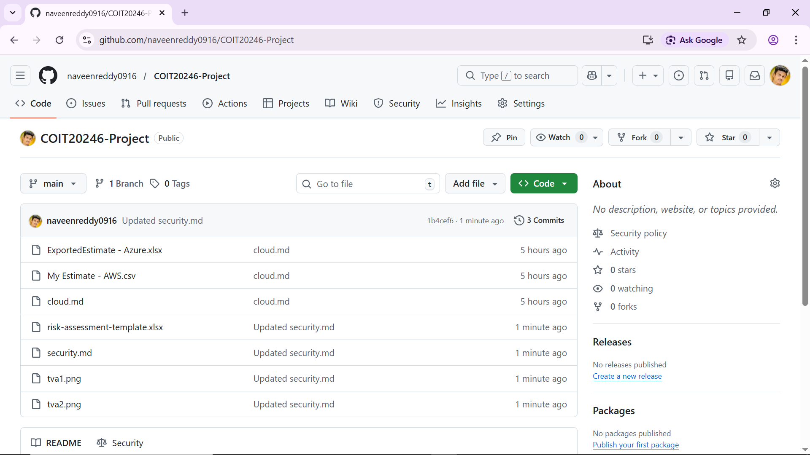
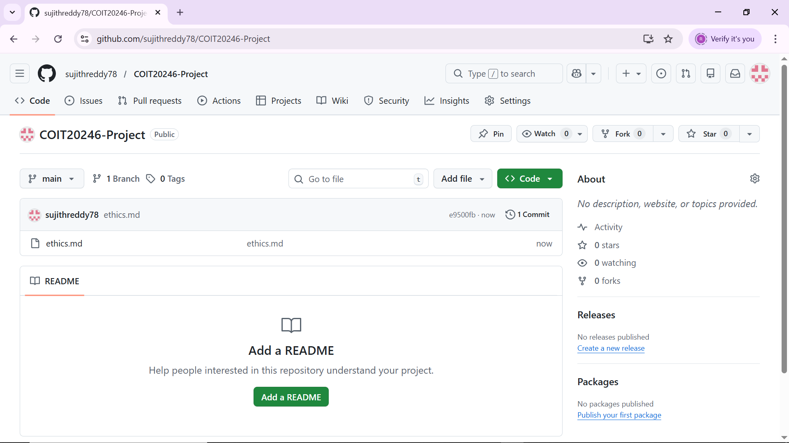

# reflection.md — 4.5 Project Reflection

## 4.5 Project Reflection
This section reflects on the team’s performance, contribution patterns, and collaboration practices across the project. Evidence is drawn from the GitHub commit history and the artefacts produced for each task.

## 4.5.1 Commit evidence (screenshot)

## 4.5.2 Actual split of tasks
| Task area | Student A (Naveen Reddy) | Sujith Reddy |
|---|---|---|
| Planning (plan.md) | Co-developed schedule/milestones | Communication plan updates and formatting |
| Network design (network.md + diagrams) | Network design inputs; addressing validation | Diagram finalisation/export; hardware list |
| Cloud services (cloud.md + exports) | AWS estimate + export; 5‑year cost formula | Azure estimate + export; comparison table |
| Security (security.md + RA template) | Risk narrative + control selection | Template completion + TVAMatrix screenshots |
| Ethics (ethics.md) | Review and edits | Main drafting + references |
| Integration & submission | Link checks and consistency review | PDF/ZIP packaging checks |

## 4.5.3 Commits vs task contribution
| Student | Total commits | Major artefacts produced | Commentary on proportionality |
|---|---:|---|---|
| Naveen Reddy | 3 | Network Design, Cloud, Security | Low commit count, but aligned with consolidated delivery of major artefacts. |
| Sujith Reddy | 1 | Ethics,  Reflection, and PPT | Commit count is very low. However, contributions were primarily document-based and submitted as integrated outputs, making fewer commits proportionate to the nature of the tasks. |

Commit counts do not always map one-to-one with effort because some outputs are created offline (e.g., diagrams, calculator exports, and spreadsheets) and then committed as larger updates. Nevertheless, the artefacts produced indicate substantive contributions to core deliverables.

## 4.5.4 Weeks with commits
Across the term, both students made commits in 2 weeks. This level of activity was sufficient relative to the project’s staged deliverables. However, more consistent weekly commits would better demonstrate continuous progress and reduce integration pressure close to deadlines.

## 4.5.5 What worked well and issues encountered
**What worked well:** Early agreement on shared assumptions (e.g., branch count, region selection, and baseline VM sizing) improved consistency across network, cloud, and security sections. Short, regular check-ins supported parallel progress on diagrams, exports, and written analysis.

**Issues encountered:** Integrating artefacts into markdown (links, file paths, and screenshots) required additional coordination and occasional rework when filenames or export settings changed. Maintaining “apples-to-apples” assumptions across cloud providers also required iterative adjustments to calculator configurations.

## 4.5.6 Recommended techniques for future group projects
1. **Define “done” criteria per task** (e.g., “export + screenshot + linked in markdown”) to prevent late-stage completeness gaps.  
2. **Use smaller, frequent commits** to improve accountability and reduce merge conflicts during integration.  
3. **Peer review via pull requests** to detect assumption mismatches (region, sizing, included/excluded costs) early.  
4. **Maintain a shared weekly checklist** to ensure required artefacts (PNG exports, template screenshots, links) are present and correctly referenced.  
5. **Schedule a final integration session** dedicated to verifying link integrity, formatting consistency, and rubric coverage prior to submission.
